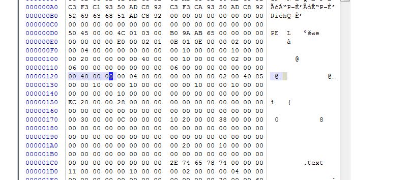
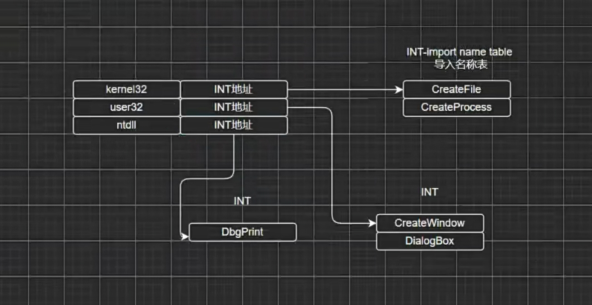
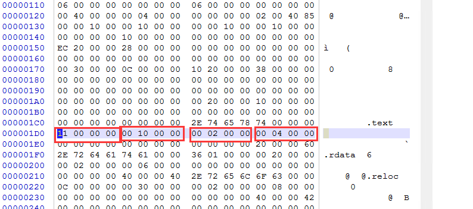
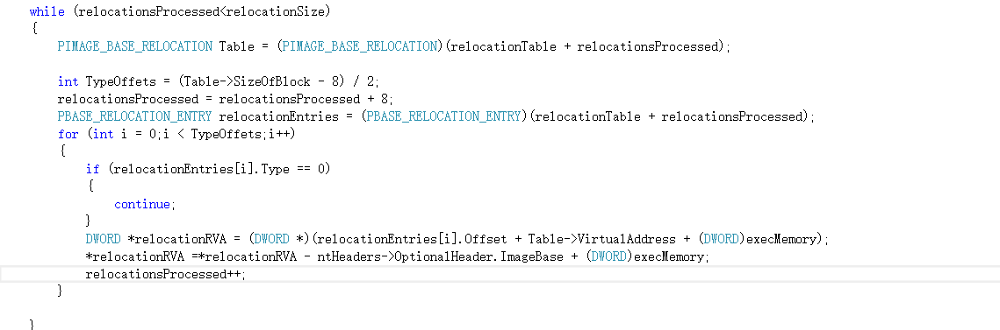
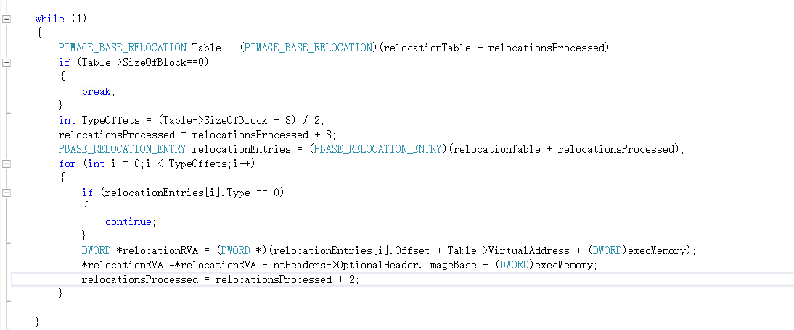
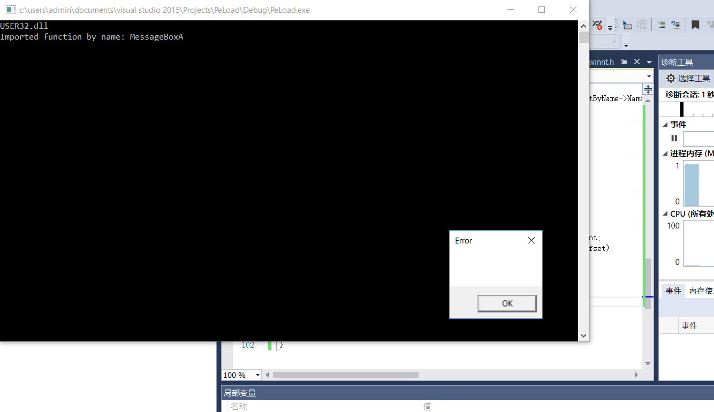
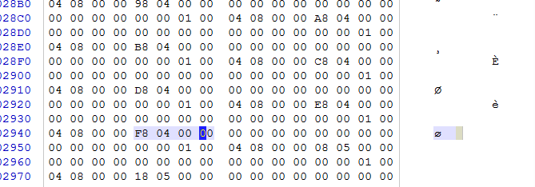

# PE头

```
IMAGE_DOS_HEADER
IMAGE_NT_HEADERS
	IMAGE_FILE_HEADER
	IMAGE_OPTIONAL_HEADER
	IMAGE_DATA_DIRECTORY[1]
	
IMAGE_SECTION_HEADER[1]

[1]代表可变
```


## IMAGE_DOS_HEADER

```
typedef struct _IMAGE_DOS_HEADER {      // DOS .EXE header
    WORD   e_magic;                     // Magic number
    WORD   e_cblp;                      // Bytes on last page of file
    WORD   e_cp;                        // Pages in file
    WORD   e_crlc;                      // Relocations
    WORD   e_cparhdr;                   // Size of header in paragraphs
    WORD   e_minalloc;                  // Minimum extra paragraphs needed
    WORD   e_maxalloc;                  // Maximum extra paragraphs needed
    WORD   e_ss;                        // Initial (relative) SS value
    WORD   e_sp;                        // Initial SP value
    WORD   e_csum;                      // Checksum
    WORD   e_ip;                        // Initial IP value
    WORD   e_cs;                        // Initial (relative) CS value
    WORD   e_lfarlc;                    // File address of relocation table
    WORD   e_ovno;                      // Overlay number
    WORD   e_res[4];                    // Reserved words
    WORD   e_oemid;                     // OEM identifier (for e_oeminfo)
    WORD   e_oeminfo;                   // OEM information; e_oemid specific
    WORD   e_res2[10];                  // Reserved words
    LONG   e_lfanew;                    // File address of new exe header
  } IMAGE_DOS_HEADER, *PIMAGE_DOS_HEADER;
```

重点关注


```
WORD   e_magic;
LONG   e_lfanew;
```

e_magic文件标识，其他的都是16位时代的东西，现在都能随便改


这个就是e_magic，word是两个字节，long是四个字节，前18占60个字节


这个是e_lfanew，所存储的地址是nt头IMAGE_NT_HEADERS


## IMAGE_NT_HEADERS


这里分为64位和32位的，结构是一样的但是长度不一样


主要有三个成员


真正pe的标识


### IMAGE_FILE_HEADER


nt头的第二个成员，文件头


一共20个字节


这一部分就是FileHeader

#### machine


第一个是可执行文件的运行平台取值有


取值有这些


#### NumberOfSections

有多少节区


当前有三个节区


#### TimeDateStamp、PointerToSymbolTable、NumberOfSymbols


这三个没啥用


#### SizeOfOptionalHeader

选项头的大小


选项头的位置在IMAGE_FILE_HEADER的，用于定位节表的位置


在IMAGE_FILE_HEADER结束后，就是可选头，可选头往后E0个字节，选项头的地址加上选项头的大小就是节表的位置


#### Characteristics

属性


上图就是属性所在的位置


对应的值


### IMAGE_OPTIONAL_HEADER32


选项头

#### Magic


取值有三个


这里是32位的选项头，第三个是家电


#### MajorLinkerVersion、MinorLinkerVersion


链接器主版本号和副版本号，基本上没啥用，可以随便改


#### SizeOfCode、SizeOfInitializedData、SizeOfUninitializedData


分别是代码的大小，初始化数据的大小，为初始化数据的大小，可以随便改


#### AddressOfEntryPoint


程序的入口点，模块首地址的偏移


00001000，再od中打开


开始执行的地方就会偏移1000，入口点简写为EP


#### BaseOfCode、BaseOfData


代码的地址和数据的地址，这两个东西也可以随便改


#### ImageBase

模块基址，pe映射进内存的首地址


加上刚刚的入口点就是内存中执行的00400000首地址，一般是建议加载到这个地址，但是不一定都能加载到这个地址


#### SectionAlignment、FileAlignment


内存偏移和文件偏移，涉及到对齐


#### MajorOperatingSystemVersion、MinorOperatingSystemVersion、MajorImageVersion、MinorImageVersion、MajorSubsystemVersion、MinorSubsystemVersion、Win32VersionValue


这几个没啥大用，MinorOperatingSystemVersion不能修改


#### SizeOfImage

可执行文件在内存中的总大小



这里大小是00004000，由各个节的大小计算而来，是内存对齐的值


#### SizeOfHeaders


pe头的大小，跟文件对齐值对齐后的值


#### CheckSum


ring3值较为宽松，驱动会严格检测这个值


#### Subsystem


这玩意不能随便改


#### DllCharacteristics


用于描述可执行文件，也不能随便改


如上图所示


#### SizeOfStackReserve、SizeOfStackCommit、SizeOfHeapReserve、SizeOfHeapCommit


可以改，但是不能太离谱，分别对应的是，保留的栈空间，提交的栈空间、保留的堆空间，提交的堆空间


#### LoaderFlags


没啥用，都可以随便改


#### DataDirectory、NumberOfRvaAndSizes


各种表的位置，他的个数由NumberOfRvaAndSizes决定


IMAGE_DATA_DIRECTORY表示表在哪里，有多大


这些是下标对应的表


# 节

## IMAGE_SECTION_HEADER


一共40个字节


    union {
            DWORD   PhysicalAddress;
            DWORD   VirtualSize;
    } Misc;

这部分共享内存占4个字节

### Name


8个字节


### PhysicalAddress、VirtualSize、VirtualAddress、SizeOfRawData、PointerToRawData

倒着看


如上图所示


如上图所示


### 举例


文件偏移400，大小200个字节


然后映射到内存偏移为1000的地址，这里要加上ImageBase的00400000，得到00401000


### 字段解析

| VirtualSize | VirtualAddress | SizeOfRawData | PointerToRawData |
| ----------- | -------------- | ------------- | ---------------- |
| 0x00000011  | 0x00001000     | 0x00000200    | 0x00000400       |
| 0x00000136  | 0x00002000     | 0x00000200    | 0x00000600       |
| 0x0000000c  | 0x00003000     | 0x00000200    | 0x00000800       |

PointerToRawData每次递增200，与SizeOfRawData一致

VirtualAddress每次递增1000，因为1000为一个内存分页

文件中节与节直接连续不断，内存中节与节也是连续不断的


文件中的计算过程如上


内存中的计算，对应改为对齐，意思就是在1011后填充一个内存页达到2000


规律：PointerToRawData和SizeOfRawData都是跟FileAlign对齐，VirtualAddress和VirtualSize是根sectionAlign对齐

上图分别是sectionAlign和FileAlign


SizeOfImage的值就是各节的和，然后加上dos头的分页


### PointerToRelocations、PointerToLinenumbers、NumberOfRelocations、NumberOfLinenumbers


系统不依赖这12个字节，可以不管


### Characteristics


初始化内存属性，节的内存属性


取值有这些，例如可读可写可执行


text段是60000020，低字节是20高字节是60


代表就是可读加可执行


低字节就是这个


## 地址转换

VA - virtual Address 虚拟地址 绝对地址

RVA -  relative Virtual address 相对模块基址的偏移

FA -  file address 文件偏移


例如VA:402080,我们减去imageBase得到RVA:2080，2080是落在VirtualAddress的2000到3000中，计算出这个内成页中的偏移得到80，2000到3000对应的PointerToRawData，是600，那么最终FA就是680


## dump

把内存中的文件还原成文件形式


### nt头


pe往下五行半就是nt头的大小，然后从头开始复制400个字节


注意是从零开始


### 节


如上图所示，重复这个操作把三个节都拷完，然后保存


可以正常执行，如何程序中涉及到全局变量，在程序运行时全局变量就已经赋值，在dump后就可能导致无法运行，所以一般在入口点处dump，也就是代码没有执行之前


## 节表注入

### 节间隙


### 添加节

1.节表添加一项

2.添加节数据

3.节表个数加一（NumBerOfSections）

4.修改SizeOfImage，文件在内存中的总大小


这里我们尝试把这个写入到新的节里面


一个节占40个字节，也就是两行半


这就是新节的位置


这里我我们将上一个节的位置和上一个节的大小相加，00000800+00000200=00000A00


小端序的方式写入


文件大小，这里要对齐


这里我们要写入的文件大小为A00，对齐后的值为A00，不需要修改


填入文件大小


00003000+0000000c=0000300c，对齐后的值为00004000，这个值就是内存中的位置


这里填入要执行的代码的大小


这里我们写入文件的大小，也可以手动对齐


剩下的数据之间复制上面的


在文件末尾复制上去节数据


这个是NumberOfSections，把它加一


他就在pe同一行对半后的倒数两个


再修改sizeofimage，这里计算有两种，每一个节在内存中的地址相加，然后再加上nt头再内存中的1000即可。或者最后一个节的地址，加上最后一个节的大小


4000+0A00=4A00，这里需要对齐，最后的值就是5000


这个值就是sizeofimage的大小，修改为


这样即可


这样改完以后就能运行了


### 拓展节

1.将最后一个节扩大

2.添加节数据

3.修改sizeofimage


# 导入表



逻辑关系


找到INT后会把对应函数的地址填入IAT表中


## IMAGE_DATA_DIRECTORY

表在选项头中的IMAGE_DATA_DIRECTORY


对应的下标就是表的位置，IMAGE_DIRECTORY_ENTRY_IMPORT就是导入表


## IMAGE_IMPORT_DESCRIPTOR


导入表的结构体


### DCharacteristics、OriginalFirstThunk;


导入名称表的地址


对应地址的结构体是PIMAGE_THUNK_DATA，最高位如果是1那么是序号导入，如果最高位是0就是名称导入，则最终指向IMAGE_IMPORT_BY_NAME


第一个没啥用，第二个是字符串


### TimeDateStamp、ForwarderChain


这里玩意没啥用


### Name


导入函数的名称


### FirstThunk


导入地址表的地址


## hex


从节开始倒数128个字符，也就是8行，就是所有的表，下标为1的是导入表


不是所有都能随意修改，这里的地址是20EC是RVA


落在第二个节里面，文件偏移是600，换算为文件偏移就是6EC


这个就是导入表的第一项，20个字节为一项，导入表以全零项结尾，也就是20个0字符


### name


name在第12个字节开始


这个就是name,是一个地址212A，这里同样是RVA，对应FA就是72A


这个就是对应的name


### int导入名称表


地址为2114，对应的FA就是714，指向的是PIMAGE_THUNK_DATA


#### PIMAGE_THUNK_DATA


这是一个数组，以全零结尾


这里最高位是0，是名称导入，指向IMAGE_IMPORT_BY_NAME，RVA位211c,FA为71c


#### IMAGE_IMPORT_BY_NAME


两个字节，加一个指针


这里导入的就是messageboxA

#### 导入地址表


这里会填api的地址


这里的地址是2000，对应的FA为600


这里最终会写入MessageBoxA的地址，而这个1c21就是导入名称表的地址


原先是21c1运行后变为7DCBFDE1


## 导入表注入

在导入表中加入自己编写的dll，当程序运行时就会运行自己的dll


这个就是导入表的位置，我们需要添加新的导入表，但是明显下面有数据所以不能往下添加


把它往下搬


我们需要重新修改导入表的位置，2000+750=2150


接下来需要完善这个结构体，先是导入名称表


这里放在FA:7B0的位置


在7B0的位置放入一个word和导出函数的名称


这里要放入导入的名称


这里就是name的位置，指向导入函数的名称


在最后4个字节写入导入地址表的地址


关系如上，这个是修改后的，与上面的有一定出入，最开始的4个字节，要指向一个地址，然后这个地址再指向字符串才行


这样子就成功注入了，已经成功加载dll了


## loadPE

根据我的尝试发生还是不太行，会出现一个问题，比如我loadlibraryA获取到MessageA的地址都填写到402000处，然后代码中调用MessageA会直接调用402000，但是我使用VirtualAlloc分配内存（这里分配的就是已经对齐后的了）加入分配在0x00dc0000，api地址实际上填入的是0x00dc0000+402000H的地址，这样调用就会出现问题，需要用重定向表来解决，这个目前还没有学，


```
#include <stdio.h>
#include <windows.h>

int main() {

	HANDLE hFile = CreateFileA("C:\\Users\\admin\\Desktop\\test.exe", GENERIC_READ, FILE_SHARE_READ, NULL, OPEN_EXISTING, FILE_ATTRIBUTE_NORMAL, NULL);

	if (hFile == INVALID_HANDLE_VALUE) {
		printf("Failed to open file\n");
		return 1;
	}

	DWORD fileSize = GetFileSize(hFile, NULL);

	LPVOID fileData = HeapAlloc(GetProcessHeap(), HEAP_ZERO_MEMORY, fileSize);

	if (fileData == NULL) {
		printf("Failed to allocate memory\n");
		CloseHandle(hFile);
		return 1;
	}

	DWORD bytesRead = 0;
	BOOL result = ReadFile(hFile, fileData, fileSize, &bytesRead, NULL);
	CloseHandle(hFile);

	if (!result || bytesRead != fileSize) {
		printf("Failed to read file\n");
		HeapFree(GetProcessHeap(), 0, fileData);
		return 1;
	}

	PIMAGE_DOS_HEADER dosHeader = (PIMAGE_DOS_HEADER)fileData;
	PIMAGE_NT_HEADERS ntHeaders = (PIMAGE_NT_HEADERS)((DWORD)fileData + dosHeader->e_lfanew);

	LPVOID execMemory = VirtualAlloc(NULL, ntHeaders->OptionalHeader.SizeOfImage, MEM_COMMIT | MEM_RESERVE, PAGE_EXECUTE_READWRITE);

	if (execMemory == NULL) {
		printf("Failed to allocate executable memory\n");
		HeapFree(GetProcessHeap(), 0, fileData);
		return 1;
	}

	memcpy(execMemory, fileData, ntHeaders->OptionalHeader.SizeOfHeaders);

	PIMAGE_SECTION_HEADER section = (PIMAGE_SECTION_HEADER)(ntHeaders->FileHeader.SizeOfOptionalHeader + (DWORD) & (ntHeaders->OptionalHeader));

	for (int i = 0; i < ntHeaders->FileHeader.NumberOfSections; ++i) {
		LPVOID destination = (LPVOID)((DWORD)execMemory + section->VirtualAddress);
		LPVOID source = (LPVOID)((DWORD)fileData + section->PointerToRawData);
		memcpy(destination, source, section->SizeOfRawData);
		section++;
	}

	PIMAGE_IMPORT_DESCRIPTOR importDesc = (PIMAGE_IMPORT_DESCRIPTOR)((LPBYTE)execMemory + ntHeaders->OptionalHeader.DataDirectory[IMAGE_DIRECTORY_ENTRY_IMPORT].VirtualAddress);

	if (ntHeaders->OptionalHeader.DataDirectory[IMAGE_DIRECTORY_ENTRY_IMPORT].Size != 0 && importDesc->Name != 0)
	{
		while (importDesc->Name != 0) {
			HMODULE hModule = LoadLibraryA((LPCSTR)((LPBYTE)execMemory + importDesc->Name));
			printf("%s\n", (char*)((DWORD)execMemory + importDesc->Name));

			PIMAGE_THUNK_DATA pOriginalThunk = (PIMAGE_THUNK_DATA)((LPBYTE)execMemory + importDesc->OriginalFirstThunk);

			DWORD* pFirstThunk = (DWORD*)((LPBYTE)execMemory + importDesc->FirstThunk);

			while (pOriginalThunk->u1.AddressOfData != 0) {
				PIMAGE_IMPORT_BY_NAME importByName = (PIMAGE_IMPORT_BY_NAME)((LPBYTE)execMemory + pOriginalThunk->u1.AddressOfData);
				printf("Imported function by name: %s\n", importByName->Name);

				LPVOID LoadFunc = GetProcAddress(hModule, (LPCSTR)(importByName->Name));
				if (LoadFunc != NULL) {
					*pFirstThunk = (DWORD)LoadFunc;
				}

				pOriginalThunk++;
				pFirstThunk++;
			}

			importDesc++;
		}
	}
	

	DWORD entryPointOffset = ntHeaders->OptionalHeader.AddressOfEntryPoint;
	DWORD(*entryPoint)() = (DWORD(*)())((DWORD)execMemory + entryPointOffset);

	entryPoint();
	

	HeapFree(GetProcessHeap(), 0, fileData);
	VirtualFree(execMemory, 0, MEM_RELEASE);

	return 0;
}

```

这里直接把对于的节映射到内存的正确位置，还有处理导入表，如果是相对地址调用的api是可以运行的


这样就能运行了


如果是绝对地址调用的api，就会出现我上述描述的问题，这里用的依然是绝对路径的实行调用api


这里的api会填到2000的位置，对于的文件偏移就是600，这个最终在内存的位置加上image40000，就是上面报错的402000


# 导出表

导出表的下标索引为0，主要是dll中的导出函数所使用

## IMAGE_EXPORT_DIRECTORY


左边的地址，右边是大小，大小有用的，占两行半


### Characteristics、TimeDateStamp、MajorVersion、MinorVersion


这四个玩意没啥用，可以随便改


左边12字节就是那四个玩意

### Name


说明性质的，也可以改


右边就是name，2540转为文件偏移就是1740，指向一个字符串


### base


这里base是00000001

### NumberOfFunctions


导出函数的地址数组个数


4个


### NumberOfNames


导出函数的名称数组个数


也是4个


### AddressOfFunctions


地址数组的地址


2518转为FA是1718


网1718后面数4个，因为NumberOfNames是4个，发现都是一个地址，这里是被vs优化掉了


重新编译dll，这些地址就是导出函数的地址(RVA)


### AddressOfNames


名称数组的位置


2538转为FA,1738


往后数4个DWORD，例如2569，对于的FA是1769


这个就是第一个导出函数的名称


### AddressOfNameOrdinals


序号数组的位置


转为FA是1748


往后数4个WORD，名称数组和序号数组数量是一致的


### base的作用

例如我想查询需要2号函数的地址，首先用2-base得到1，然后根据1去找AddressOfFunctions数组的下标，如果是根据名称查询则不需要base


# 重定位表

基址重定位,索引为5，当代码中出现绝对地址的应用，在加载pe时不不一定能每次都申请到原本的基址，这个时候就需要重定位

## IMAGE_BASE_RELOCATION


8个字节，加上一个柔性数组，这是后面的长度不定，长度有SizeOfBlock，重定位表记录地址是已内存分页加偏移的实现例如


```
00001025
00001034
00001104

00001000 0025 0034 0104
会已这种方式记录
```

VirtualAddress记录的就是00001000

TypeOffset记录的就是页内偏移0025 0034 0104

SizeOfBlock的大小等于，VirtualAddress+SizeOfBlock+TypeOffset的和

要计算TypeOffset的大小就等于，(SizeOfBlock-8)/2，除以二是因为WORD，这样就能算出来有多少个偏移


```
00001000 0025 0034 0104
```

根据观察可以发现记录页内偏移其实只需要3个数字，也就是低12位，高4位是没有用的


```
00001000 0|025 0|034 0|104
```

而高4位一般会填写types值


常见这三个

10一般出现在16位和64位的pe中，如果是0说明这个地址不需要修正，如果是3则这个地址需要修正

一个IMAGE_BASE_RELOCATION修正一个分页，多个分页则需要多个IMAGE_BASE_RELOCATION，到大有多少个则需要看IAMGE_DATA_DIRECTORY中的Size


## hex


这里重定位表的地址是3000，大小为c


这里sizeofblock是c，也就是整个的大小是c个字节


这一部分就是第一个结构体


往后数，直到0000为止，300a,这里分为高4位和低12位，3|00A，高4位的3说明需要重定位，00A是页内偏移，需要加上VirtualAddress的1000，得到需要修改的地址是100A


对应为文件偏移就是40A，开始数8个字节，绝对地址是8个字节，00402000


这里地址就是上面我写peload报错的地址，这个时候就需要修正为新的地址，这个时候只要加上申请内存的首地址即可


## 重写peload

### 读取到堆


将文件写入到堆中


### dos和nt


获取dos头和nt头，在dos头的最后一项能得到nt的的地址


### 分配内存


通过nt都的选项头获取到占内存的大小，使用VirtualAlloc分配rwx的内存


### 节处理


先把nt头和dos头等等，也就是第一个分页拷贝过去


这个是选项头的大小在IMAGE_FILE_HEADER


选项头的地址，加上选项头的大小，就得到了节的位置


这里就是第一个IMAGE_SECTION_HEADER




我们拿第一个节举例，把FA为400大小为200，复制到RVA为1000的位置，1100000可以不管


节的数量可以在nt头的文件头中获取，每次循环就重复刚刚winhex描述的步骤，不断copy过去


### 重定位表处理


数据目录获取到重定位表的地址


relocationsProcessed表示当前在重定位表开始的第几个字节，在转为想要的结构体指针


最开始我想通过这种方式计算高地址是不是0，发现有点奇怪


```
typedef struct BASE_RELOCATION_ENTRY {
	USHORT Offset : 12;
	USHORT Type : 4;
} BASE_RELOCATION_ENTRY, *PBASE_RELOCATION_ENTRY;
```

这里先定义这样一个结构体，一样能达到效果


这样子就能正确取出高地址和地址在了




最终的代码就是，获取当前的重定位表，计算typeoffes的个数，往后偏移8个字节，开始循环typeoffes，把原本的RVA减去imagebase再加上分配的内存地址，得到新的地址，修改到原来的位置即可


原本的VA为402000


修改后得到新的VA




发现有点问题，最后修改了条件，当SizeOfBlock等于0的时候终止循环


### 导入表


获取导入表的位置，并判断是否存在导入表


导入表以全0项结尾第一个2114是导入名称表的地址，能够获取到需要加载的函数名称，2114指向的是一个数组，这个数组保存了，所有需要导入的函数名称


然后就是name，保存了需要导入dll


最后一项保存了，函数地址写在哪，我们可以注意到，这里有两个数组，第一个数组是导入名称表，第二个数组的导入地址表，分别对应的是，OriginalFirstThunk和FirstThunk，思路就很情绪了，通过name获取需要loadlibrary的dll，然后使用OriginalFirstThunk获取函数名称，获取到的地址写入FirstThunk，随后OriginalFirstThunk和FirstThunk自增


最后就完成了导入表的处理


### 入口点


再把入口点转为函数指针，调用即可




成功弹窗

## 源代码

```
#include <Windows.h>
#include<stdio.h>

typedef struct BASE_RELOCATION_ENTRY {
	USHORT Offset : 12;
	USHORT Type : 4;
} BASE_RELOCATION_ENTRY, *PBASE_RELOCATION_ENTRY;

int main()
{
	HANDLE pe = CreateFileA("C:\\Users\\admin\\Desktop\\inst.exe", GENERIC_READ, NULL, NULL, OPEN_EXISTING, NULL, NULL);
	DWORD64 peSize = GetFileSize(pe, NULL);
	LPVOID peBytes = HeapAlloc(GetProcessHeap(), HEAP_ZERO_MEMORY, peSize);

	DWORD outSize = 0;
	ReadFile(pe, peBytes, peSize, &outSize, NULL);

	PIMAGE_DOS_HEADER dosHeaders = (PIMAGE_DOS_HEADER)peBytes;
	PIMAGE_NT_HEADERS ntHeaders = (PIMAGE_NT_HEADERS)((DWORD_PTR)peBytes + dosHeaders->e_lfanew);

	SIZE_T peImageSize = ntHeaders->OptionalHeader.SizeOfImage;
	LPVOID execMemory = VirtualAlloc(NULL, ntHeaders->OptionalHeader.SizeOfImage, MEM_COMMIT | MEM_RESERVE, PAGE_EXECUTE_READWRITE);

	memcpy(execMemory, peBytes, ntHeaders->OptionalHeader.SizeOfHeaders);

	PIMAGE_SECTION_HEADER section = (PIMAGE_SECTION_HEADER)(ntHeaders->FileHeader.SizeOfOptionalHeader + (DWORD) & (ntHeaders->OptionalHeader));

	for (int i = 0; i < ntHeaders->FileHeader.NumberOfSections; ++i) {
		LPVOID destination = (LPVOID)((DWORD)execMemory + section->VirtualAddress);
		LPVOID source = (LPVOID)((DWORD)peBytes + section->PointerToRawData);
		memcpy(destination, source, section->SizeOfRawData);
		section++;
	}

	IMAGE_DATA_DIRECTORY relocations = ntHeaders->OptionalHeader.DataDirectory[IMAGE_DIRECTORY_ENTRY_BASERELOC];
	DWORD relocationTable = relocations.VirtualAddress + (DWORD)execMemory;
	DWORD relocationSize = relocations.Size;
	DWORD relocationsProcessed = 0;

	while (1)
	{
		PIMAGE_BASE_RELOCATION Table = (PIMAGE_BASE_RELOCATION)(relocationTable + relocationsProcessed);
		if (Table->SizeOfBlock==0)
		{
			break;
		}
		int TypeOffets = (Table->SizeOfBlock - 8) / 2;
		relocationsProcessed = relocationsProcessed + 8;
		PBASE_RELOCATION_ENTRY relocationEntries = (PBASE_RELOCATION_ENTRY)(relocationTable + relocationsProcessed);
		for (int i = 0;i < TypeOffets;i++)
		{
			if (relocationEntries[i].Type == 0)
			{
				continue;
			}
			DWORD *relocationRVA = (DWORD *)(relocationEntries[i].Offset + Table->VirtualAddress + (DWORD)execMemory);
			*relocationRVA = *relocationRVA - ntHeaders->OptionalHeader.ImageBase + (DWORD)execMemory;
			relocationsProcessed = relocationsProcessed + 2;
		}

	}

	PIMAGE_IMPORT_DESCRIPTOR importDesc = (PIMAGE_IMPORT_DESCRIPTOR)((LPBYTE)execMemory + ntHeaders->OptionalHeader.DataDirectory[IMAGE_DIRECTORY_ENTRY_IMPORT].VirtualAddress);

	if (ntHeaders->OptionalHeader.DataDirectory[IMAGE_DIRECTORY_ENTRY_IMPORT].Size != 0 && importDesc->Name != 0)
	{
		while (importDesc->Name != 0) {
			HMODULE hModule = LoadLibraryA((LPCSTR)((LPBYTE)execMemory + importDesc->Name));
			printf("%s\n", (char*)((DWORD)execMemory + importDesc->Name));

			PIMAGE_THUNK_DATA pOriginalThunk = (PIMAGE_THUNK_DATA)((LPBYTE)execMemory + importDesc->OriginalFirstThunk);

			DWORD* pFirstThunk = (DWORD*)((LPBYTE)execMemory + importDesc->FirstThunk);

			while (pOriginalThunk->u1.AddressOfData != 0) {
				PIMAGE_IMPORT_BY_NAME importByName = (PIMAGE_IMPORT_BY_NAME)((LPBYTE)execMemory + pOriginalThunk->u1.AddressOfData);
				printf("Imported function by name: %s\n", importByName->Name);

				LPVOID LoadFunc = GetProcAddress(hModule, (LPCSTR)(importByName->Name));
				if (LoadFunc != NULL) {
					*pFirstThunk = (DWORD)LoadFunc;
				}

				pOriginalThunk++;
				pFirstThunk++;
			}

			importDesc++;
		}
	}

	DWORD entryPointOffset = ntHeaders->OptionalHeader.AddressOfEntryPoint;
	DWORD(*entryPoint)() = (DWORD(*)())((DWORD)execMemory + entryPointOffset);

	entryPoint();


	HeapFree(GetProcessHeap(), 0, peBytes);
	VirtualFree(execMemory, 0, MEM_RELEASE);

	return 0;
}
```

最终就完成了手动加载pe文件

# 资源表

下标为2

## IMAGE_RESOURCE_DIRECTORY


前4个没啥用，这里注释也是成员，只不过是柔性数组


## NumberOfNamedEntries


以字符串作为资源的id的个数


## NumberOfIdEntries


以数值作为资源的id的个数


## IMAGE_RESOURCE_DIRECTORY_ENTRY


这个数组有几项，等于NumberOfNamedEntries+NumberOfIdEntries，往下滑能找到它的结构体


一共两个成员DUMMYUNIONNAME和DUMMYUNIONNAME2，一共占8个字节，union的大小由最大成员决定


### DUMMYUNIONNAME

看最高位和低31位，最高位是1，那么这个资源的id是字符串，那么低31位指向字符串偏移，这里是节内偏移，最高位是0，那么低位id是数值

一般只会嵌套三层，第一层是类型，第三层是代码页

#### IMAGE_RESOURCE_DIRECTORY_STRING


指向的字符串是这个结构


### DUMMYUNIONNAME2

指明是文件夹还是文件


最高位为1那么这是一个文件夹，低31位是节内偏移，按照IMAGE_RESOURCE_DIRECTORY解析


如果最高位是0，则是一个文件，低31为是节内偏移，按照IMAGE_RESOURCE_DATA_ENTRY解析


#### IMAGE_RESOURCE_DATA_ENTRY


第一个是资源的偏移RVA，第二个是大小


## hex


偏移5000


落在文件偏移2600处

### IMAGE_RESOURCE_DIRECTORY


前12个字节没啥用，对应这IMAGE_RESOURCE_DIRECTORY开始的前4个成员，然后就是两个word


以字符串作为id的个数为0，以数值作为id的资源的个数为7，后面就会跟7个IMAGE_RESOURCE_DIRECTORY_ENTRY


### IMAGE_RESOURCE_DIRECTORY_ENTRY


一个IMAGE_RESOURCE_DIRECTORY_ENTRY有8个字节


这里的03 04 ...分别是资源类型，这是第一层


所有类型的取值，我们已RT_MENU举例


这里资源的类型是RT_MENU，随后就是E8000080,最高位是1说明是目录，节内偏移是E8


最终指向26E8，这里是目录任然按照IMAGE_RESOURCE_DIRECTORY解析


加起来是1，后面跟着1个IMAGE_RESOURCE_DIRECTORY_ENTRY


最高位是1，那么是已数值保存资源id,6D是十进制是109


我们可以看到109是什么


最高位为1，节内偏移是0330，高字节在右边


依然按照目录解析


后面跟着1个


这里是第三层就会变成代码页，这里是804，对应十进制是2052


直接百度就能找到对应的编码


chcp 2052直接无效代码页了




04的二进制是0100，则最高位是0，这个是文件，对应的偏移是4F8


按照IMAGE_RESOURCE_DATA_ENTRY解析


### IMAGE_RESOURCE_DATA_ENTRY


后面两个dowrd一般都是0忽略。第一个是资源的偏移RVA，第二个是大小


RVA是01BE90大小是50，对应文件偏移是19490


这个就是它的MENU的资源了


更换编码就能看到菜单的信息了，大致就是这样一个嵌套的流程其他的也一致
